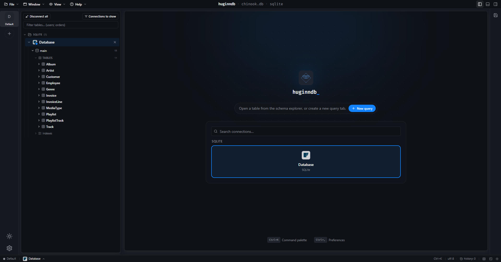
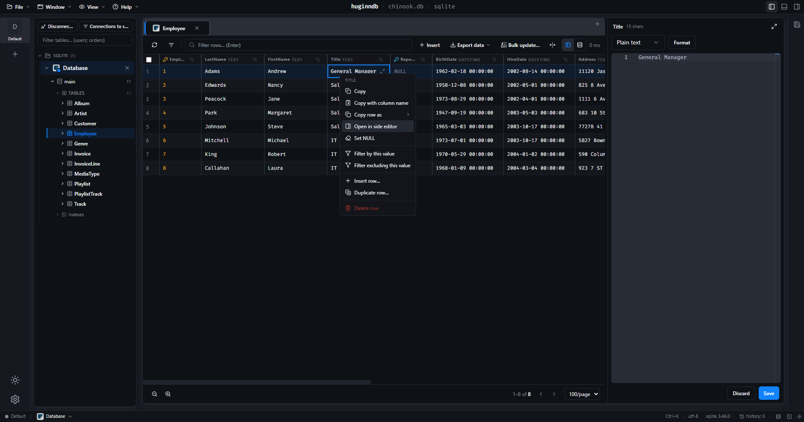
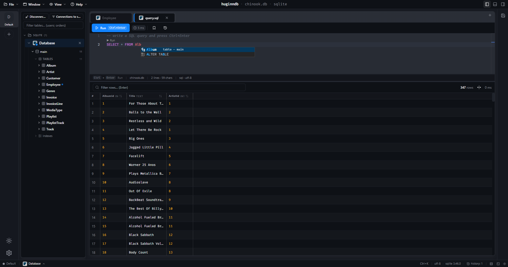
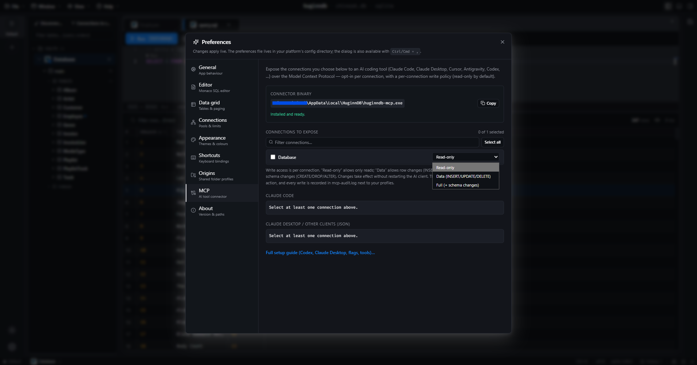

<div align="center">

# HuginnDB

**A fast, keyboard-friendly desktop database manager.**

[](LICENSE)
[](#status)
[](https://v2.tauri.app)
[](https://www.rust-lang.org)
[](https://www.typescriptlang.org)

HuginnDB is a cross-platform desktop client for **PostgreSQL**, **MySQL**, **SQLite**, **MongoDB**, and **Microsoft SQL Server**. It pairs a minimalist UI with a first-class cell editor and a Monaco-powered SQL workspace — the goal is to make routine database work feel as fluid as your text editor. A headless [MCP connector](docs/MCP.md) (`huginndb-mcp`) exposes the same connections to AI coding tools like Claude Code, Claude Desktop, and Cursor.

</div>

---

## Table of contents

- [Why HuginnDB?](#why-huginn)
- [How it compares](#how-it-compares)
- [Features](#features)
- [Status](#status)
- [Screenshots](#screenshots)
- [Installation](#installation)
  - [Prerequisites](#prerequisites)
  - [From source](#from-source)
- [Usage](#usage)
  - [Connecting to a sample database](#connecting-to-a-sample-database)
  - [Keyboard shortcuts](#keyboard-shortcuts)
- [Architecture](#architecture)
- [MCP connector](#mcp-connector)
- [Security model](#security-model)
- [Roadmap](#roadmap)
- [Contributing](#contributing)
- [License](#license)
- [Acknowledgements](#acknowledgements)

## Why HuginnDB?

Most database GUIs are either heavyweight Java IDEs or web-based dashboards that fight you the moment you need to inspect a 50&nbsp;KB JSON blob inside a column. HuginnDB picks a narrower scope:

- **Inspecting and editing data is the primary job.** Every cell can be opened in a full Monaco editor with auto-detected syntax highlighting and validation.
- **The SQL editor is a real editor.** Same component, same shortcuts, schema-aware autocomplete, query history.
- **Keyboard-first, minimal chrome.** Dark mode by default, no nested toolbars, no popup soup.
- **Credentials never touch disk in plaintext.** Passwords go to the OS keychain.

It's named after [Huginn](https://en.wikipedia.org/wiki/Huginn_and_Muninn), one of Odin's ravens — the one who fetches information.

## How it compares

No two of these tools are chasing the same thing, and all four below are genuinely good at what they do (DBeaver and HeidiSQL are two of the reasons HuginnDB looks the way it does — see [Acknowledgements](#acknowledgements)). This is where HuginnDB sits relative to them, checked against each project's own docs/pricing pages as of writing (August 2026) — always double-check the vendor's site for anything that's moved since.

|                          | **HuginnDB**                                                   | DBeaver (CE)                                              | TablePlus                                                       | HeidiSQL                                          | DataGrip                                                        |
| ------------------------ | ---------------------------------------------------------------- | ----------------------------------------------------------- | ------------------------------------------------------------------ | ---------------------------------------------------- | ------------------------------------------------------------------ |
| **License / price**      | MIT, free                                                         | Apache-2.0 (CE) free; paid tiers from ~$110/yr for more drivers/SSO | Proprietary; free tier capped (2 tabs/windows/filters), ~$99 perpetual license | GPL-2.0, free                                       | Paid (~$99/yr); free for non-commercial use since Oct 2025           |
| **Platforms**            | Windows, Linux (macOS unverified)                                 | Windows, macOS, Linux                                        | Windows, macOS, Linux                                               | Windows-native (Linux via Wine; no native macOS)     | Windows, macOS, Linux                                                |
| **MongoDB**              | ✅ native                                                          | ❌ in Community — only paid Lite/Enterprise/Ultimate         | ✅ (Beta)                                                            | ❌                                                     | ✅                                                                    |
| **SQL Server**           | ✅                                                                  | ✅ (JDBC)                                                     | ✅                                                                    | ✅                                                     | ✅                                                                    |
| **Per-cell editor**      | Full Monaco pane — JSON/XML/SQL highlighting, live validation, `F11` fullscreen | Inline / basic value viewer                                  | Inline / basic value viewer                                          | Inline / basic value viewer                          | Inline / basic value viewer                                          |
| **Credential storage**   | OS keychain, always                                               | Local encrypted file + optional master password (not an OS keychain by default) | Keychain confirmed on macOS; Windows mechanism undocumented          | Windows Registry, obfuscated (not strong encryption) | OS-native (Keychain / Secret Service / Credential-Store-backed)      |
| **AI / MCP connector**   | Built-in, free — any MCP client (Claude Code, Claude Desktop, Cursor, …) | MCP server is a paid Team Edition feature                    | Built-in LLM chat with MCP support, not exposed to external AI clients | None                                                  | Built-in MCP server (2026.1+), consent-gated                          |
| **UI weight**            | Keyboard-first, minimal chrome                                    | Full IDE (Eclipse-based)                                     | Lightweight, native                                                  | Lightweight, native                                  | Full IDE (JetBrains)                                                  |

Sources: [DBeaver editions](https://dbeaver.com/edition/) · [DBeaver MongoDB support](https://dbeaver.com/docs/dbeaver/MongoDB/) · [DBeaver master password](https://github.com/dbeaver/dbeaver/wiki/Managing-Master-Password) · [DBeaver Team Edition MCP server](https://dbeaver.com/docs/team-edition/web/Model-Context-Protocol-Server/) · [TablePlus pricing](https://tableplus.com) · [TablePlus MongoDB](https://tableplus.com/blog/2019/08/tableplus-native-gui-client-mongodb.html) · [TablePlus MCP announcement](https://x.com/TablePlus/status/1935585135472287819) · [HeidiSQL](https://www.heidisql.com) · [HeidiSQL credential storage discussion](https://github.com/HeidiSQL/HeidiSQL/issues/1489) · [DataGrip free non-commercial tier](https://blog.jetbrains.com/datagrip/2025/10/01/datagrip-is-now-free-for-non-commercial-use/) · [DataGrip password storage](https://www.jetbrains.com/help/datagrip/reference-ide-settings-password-safe.html) · [DataGrip MCP server](https://www.jetbrains.com/help/datagrip/mcp-server.html)

## Features

- **Multi-driver connection manager.** PostgreSQL, MySQL, SQLite, MongoDB, and SQL Server, each with a per-driver dialog and the right defaults, plus SSH tunnelling for remote hosts.
- **Schema explorer.** Tree of databases → tables/views/collections → columns (with type badges and primary-key indicators) and indexes.
- **Data browser.** Paginated, sortable, filterable grid built on [TanStack Table](https://tanstack.com/table). Inline cell edits are routed through the backend with PK-based safety.
- **Expanded cell editor.** Pop any cell into a Monaco editor with auto-detected JSON / XML / SQL highlighting, format/beautify, live JSON validation, and an `F11` fullscreen toggle.
- **SQL workspace.** Monaco-based, self-hosted (no CDN dependency), with schema-aware autocomplete, `Ctrl+Enter` to run, per-statement "▶ Run" CodeLens, and a per-connection history sidebar that survives restarts.
- **View editor.** Create, edit, rename, and drop views with a live preview grid and a read-only DDL pane.
- **Table structure editor.** Visual `ALTER TABLE` — add/rename/drop columns, change types, PK/FK/index changes — previewed as the exact DDL that will run.
- **Server-side security panel.** Read users/roles and their privileges straight from the server, for every supported driver.
- **MCP connector.** `huginndb-mcp`, a headless stdio server, lets an AI coding assistant browse schemas, run queries, and (opt-in, per connection) write — see [`docs/MCP.md`](docs/MCP.md).
- **Saved queries.** A local library with name, description, and tags. Open any entry into a fresh query tab.
- **Multi-window.** Pop a connection's workspace, or even a single tab, out into its own OS window.
- **Themes.** Five built-in presets (HuginnDB Dark, HuginnDB Light, Dim, Solarized Dark, High Contrast) plus a visual colour editor. Editing a preset forks it into a new custom theme so the originals stay pristine.
- **Resizable layout.** Both horizontal (sidebar) and vertical (editor / results) splits are draggable, and the arrangement is restored across restarts.

## Status

**Stable**, SemVer since `1.0`. The MVP is feature-complete for read/write workflows against every supported driver, and the project has been through several triage rounds of real-world usage (see `CHANGELOG.md`). Known gaps: no automated frontend tests yet, macOS builds are unverified, and Windows binaries aren't code-signed yet (see [Roadmap](#roadmap)). Windows and Linux (`x86_64`) artifacts are both published per release; arm64, `.rpm` and Flatpak/Snap/AUR packaging are not.

## Screenshots

<!--
  Drop screenshots into docs/screenshots/ using these exact filenames and the
   tags below will pick them up automatically — see docs/screenshots/README.md
  for capture guidance (resolution, theme, what to show in each shot).
    - overview.png       main window: schema tree + data grid + SQL tab, dark theme
    - cell-editor.png    a cell expanded into the fullscreen Monaco editor (JSON works best)
    - sql-workspace.png  the SQL editor with autocomplete / CodeLens visible
    - mcp-settings.png   Settings → MCP panel showing the generated client config
-->

<p align="center">
  
</p>

<table>
  <tr>
    <td width="50%" valign="top">
      <br>
      <sub align="center">Full Monaco editor for any cell — JSON / XML / SQL auto-detected, live validation, <code>F11</code> fullscreen.</sub>
    </td>
    <td width="50%" valign="top">
      <br>
      <sub align="center">Schema-aware SQL editor — <code>Ctrl+Enter</code> to run, per-statement CodeLens, history that survives restarts.</sub>
    </td>
  </tr>
</table>

<p align="center">
  <br>
  <sub>Settings → MCP — point Claude Code, Claude Desktop, Cursor, or any MCP client at your real schema.</sub>
</p>

## Installation

### From a release (Windows)

Download the latest `-setup.exe` installer from the [Releases page](https://github.com/Alexfp28/huginnDB/releases) and run it.

> **Windows SmartScreen warning.** Because HuginnDB binaries are not yet signed with an Authenticode certificate, Windows Defender SmartScreen will show a blue *"Windows protected your PC"* dialog on first launch. This is the default behaviour for any unsigned executable from a publisher SmartScreen has not seen before — it is not a malware detection. To continue, click **More info** (*Más información*) and then **Run anyway** (*Ejecutar de todas formas*). Code signing is on the roadmap; in the meantime, you can verify the SHA-256 of the downloaded installer against the digest published on the Releases page. The full source is in this repository and reproducible builds are encouraged.

### From a release (Linux)

Two `x86_64` artifacts are published per release — pick whichever suits you:

```bash
# .deb — Debian, Ubuntu, Mint, Pop!_OS, …
sudo apt install ./HuginnDB_<version>_amd64.deb

# .AppImage — any distro, no install step
chmod +x HuginnDB_<version>_amd64.AppImage
./HuginnDB_<version>_amd64.AppImage
```

The `.deb` pulls its runtime dependencies (`libwebkit2gtk-4.1`, `libappindicator3`, …) through apt. The AppImage bundles them, so it needs nothing but a FUSE-capable kernel — but because an AppImage links against the glibc of the machine that built it, and these are built on Ubuntu 22.04, distros older than that may refuse to start it. Build from source in that case.

There is no `aarch64`/arm64 build, no `.rpm`, and no Flatpak/Snap/AUR packaging yet — see [`ROADMAP.md`](ROADMAP.md).

### Prerequisites

| Tool                     | Why                                              | Install                                                                   |
| ------------------------ | ------------------------------------------------ | ------------------------------------------------------------------------- |
| **Node.js ≥ 20**         | Vite, TypeScript, frontend tooling.              | [nodejs.org](https://nodejs.org) or [`fnm`](https://github.com/Schniz/fnm) |
| **pnpm ≥ 10**            | The only supported package manager.              | `npm i -g pnpm`                                                           |
| **Rust (stable)**        | Compiles the Tauri backend.                       | [rustup.rs](https://rustup.rs)                                            |
| **Platform Tauri prereqs** | Native build deps (compiler, webview, etc.). | See platform-specific list below.                                          |

> **Always use pnpm.** Do not invoke `npm` or `yarn` against this repository — the lockfile is pnpm-only.

#### Windows

1. **Visual Studio Build Tools 2022** with the *Desktop development with C++* workload.
   ```powershell
   winget install --id Microsoft.VisualStudio.2022.BuildTools -e --override "--add Microsoft.VisualStudio.Workload.VCTools --includeRecommended --quiet --wait"
   ```
2. **WebView2** is preinstalled on Windows 11. On Windows 10, install the [Evergreen Bootstrapper](https://developer.microsoft.com/microsoft-edge/webview2/).

#### Linux

```bash
sudo apt install -y \
  libwebkit2gtk-4.1-dev build-essential curl wget file \
  libxdo-dev libssl-dev libayatana-appindicator3-dev \
  librsvg2-dev libsoup-3.0-dev libsecret-1-dev
```

Equivalent packages exist on Fedora, Arch, and Alpine — see the [Tauri prerequisites](https://v2.tauri.app/start/prerequisites/) for the per-distro names.

#### macOS

```bash
xcode-select --install
```

macOS is not a primary target yet but the build should work — please file an issue if you hit something.

### From source

```bash
git clone https://github.com/Alexfp28/huginnDB.git
cd huginnDB
pnpm install
pnpm tauri:dev          # dev mode with HMR
# or
pnpm tauri:build        # release bundle in src-tauri/target/release/bundle/
```

The first `tauri:dev` is slow — Cargo compiles `sqlx` with three database drivers, the `mongodb` driver, `keyring`, `tokio`, and friends, all from scratch. Plan for **5–10 minutes** on a typical laptop. Incremental rebuilds afterwards take well under 10 seconds.

Release bundles land under `src-tauri/target/release/bundle/`:

- **Windows** — NSIS `-setup.exe` installer.
- **Linux** — `.deb` and `.AppImage`.

## Usage

### Connecting to a sample database

The fastest way to play with HuginnDB is the [Chinook](https://github.com/lerocha/chinook-database) sample database in SQLite — a single file you can point HuginnDB at:

```bash
mkdir -p sample-data
curl -L -o sample-data/chinook.db \
  https://github.com/lerocha/chinook-database/raw/master/ChinookDatabase/DataSources/Chinook_Sqlite.sqlite
```

Then in HuginnDB:

1. Click the **+** in the **Connections** panel.
2. Pick **SQLite** as the driver.
3. Paste the absolute path to `chinook.db` into **Database file path**.
4. Test → Save → Connect.

Tables like `Album`, `Artist`, and `Invoice` should appear in the schema explorer. Try this query in a new query tab:

```sql
SELECT ar.Name AS artist,
       COUNT(*) AS albums
FROM Artist ar
JOIN Album al ON al.ArtistId = ar.ArtistId
GROUP BY ar.ArtistId
ORDER BY albums DESC
LIMIT 10;
```

### Keyboard shortcuts

| Action                          | Shortcut       |
| ------------------------------- | -------------- |
| Run the current query           | `Ctrl+Enter`   |
| Expand the focused cell         | Double-click   |
| Fullscreen the cell editor      | `F11`          |
| Exit fullscreen / close editor  | `Esc`          |
| Toggle light/dark mode          | Sun/moon icon  |
| Open settings & theme editor    | Gear icon      |

## Architecture

HuginnDB is split into two cooperating processes:

```
┌─────────────────────────────┐         ┌──────────────────────────────┐
│      Tauri webview          │         │       Rust backend            │
│  React + TypeScript + Vite  │  invoke │  tauri::command handlers      │
│  Zustand stores             │ <─────> │  sqlx (PG/MySQL/SQLite)       │
│  TanStack Table + Monaco    │   IPC   │  + mongodb driver             │
│                             │         │  keyring (OS keychain)        │
└─────────────────────────────┘         └────────────────────────────────┘
```

- The **frontend** never opens a database connection. It calls `api.*` (a thin typed wrapper around Tauri's `invoke`) and renders whatever the backend returns.
- The **backend** owns all live `sqlx` pools and resolves passwords against the OS keychain at the moment of use. Connection strings are never exposed to the webview.

For a deeper map of the code layout, read [`CONTRIBUTING.md`](CONTRIBUTING.md#project-layout). The two starter files are:

- `src-tauri/src/lib.rs` — Rust entry point and command registry.
- `src/App.tsx` — top-level React layout.

### Tech stack

- **Shell**: [Tauri 2](https://v2.tauri.app) (Rust + WebView).
- **Frontend**: React 18, TypeScript (strict), Vite, Tailwind CSS, [shadcn-style](https://ui.shadcn.com) Radix primitives.
- **State**: [Zustand](https://github.com/pmndrs/zustand) with `persist` middleware for theme, history, and saved queries.
- **Data grid**: [TanStack Table v8](https://tanstack.com/table).
- **Editor**: [Monaco](https://microsoft.github.io/monaco-editor/) (self-hosted; no CDN).
- **Backend**: Rust, [sqlx](https://github.com/launchbadge/sqlx) (PostgreSQL, MySQL, SQLite), the official [`mongodb`](https://crates.io/crates/mongodb) driver, [keyring](https://crates.io/crates/keyring), [tokio](https://tokio.rs), [thiserror](https://crates.io/crates/thiserror).
- **Bundling**: Tauri bundler — NSIS `-setup.exe` (Windows), `.deb` / `.AppImage` (Linux).

## MCP connector

HuginnDB ships a headless [Model Context Protocol](https://modelcontextprotocol.io) server, `huginndb-mcp`, so an AI coding assistant can work against your *actual* databases instead of guessing schema and sample data from memory. It's a separate stdio process — installed as a sidecar right next to the main app, nothing to build — that reuses the connection profiles and OS-keychain passwords you already have in HuginnDB, opening its own pools lazily and only for the connections you explicitly expose.

- **Any MCP client works**: Claude Code, Claude Desktop, Cursor, Antigravity, Codex, or anything else that speaks the stdio MCP protocol.
- **Read-only by default.** Each exposed connection has a write policy — `read-only` (default), `data`, or `full` — set per connection in **Settings → MCP**, re-read from disk on every write attempt.
- **Tools**: `list_connections`, `list_databases`, `list_tables`, `describe_table`, `list_indexes`, `run_query`, `browse_table`, `server_version`, `list_users`/`list_privileges`, and (once a connection's policy allows it) `insert_row`/`update_cell`/`delete_rows`.
- **Audited.** Every write attempt — success or failure — is appended to `mcp-audit.log`. Whole-table `UPDATE`/`DELETE` with no `WHERE` is refused outright, at any policy level.
- Settings → MCP in the app shows the sidecar's resolved path and generates ready-to-paste config for your client.

Quick start with Claude Code:

```bash
claude mcp add huginndb -s user -- /absolute/path/to/huginndb-mcp --connections <profile-id>
```

Full reference — client-by-client config, all flags, the tool list, and the security model — in [`docs/MCP.md`](docs/MCP.md); design rationale in [`docs/MCP_CONNECTOR_ROADMAP.md`](docs/MCP_CONNECTOR_ROADMAP.md).

## Security model

HuginnDB is a single-user desktop tool. The threat model is primarily a curious local user or a hostile database operator, not a remote attacker reaching the user's machine.

- **Credentials**: stored in the OS keychain (Windows Credential Manager, libsecret on Linux, Keychain on macOS) via the [`keyring`](https://crates.io/crates/keyring) crate. The on-disk profile JSON contains only metadata (host, port, db, username, SSL toggle).
- **Database I/O isolation**: all `sqlx` access lives in the Rust process. The frontend cannot reach a database directly.
- **No telemetry**: the binary does not phone home.
- **CSP**: currently disabled (`csp: null`) because Monaco needs to load its workers. Workers are bundled by Vite — not loaded from a CDN — so the relaxation is narrowly scoped. Tightening this is on the roadmap.
- **Identifier quoting** in dynamic SQL is intended for catalog-sourced identifiers; user-supplied data always travels through bound parameters.

If you find a vulnerability, please follow [SECURITY.md](SECURITY.md).

## Roadmap

The full, current roadmap — what's shipped, what's open, ordered by priority
— lives in [`ROADMAP.md`](ROADMAP.md). Top of the open list right now:

1. Bulk row insert in the data browser (bulk delete already shipped).
2. Schema diff and export (DDL extraction, side-by-side compare).
3. More drivers — ClickHouse, DuckDB (Microsoft SQL Server shipped; its DDL
   surface is still pending).
4. Tighter CSP for the webview.

Have a different priority? Open a [feature request](.github/ISSUE_TEMPLATE/feature_request.md).

## Contributing

PRs welcome. Read [CONTRIBUTING.md](CONTRIBUTING.md) first — it covers the project layout, commit conventions, coding standards per language, and a recipe for adding a new database driver.

Newcomer-friendly issues are labelled `good first issue`.

## License

[MIT](LICENSE). Use it, fork it, ship products with it.

## Acknowledgements

HuginnDB stands on the shoulders of giants:

- [Tauri](https://v2.tauri.app) for the desktop runtime.
- [sqlx](https://github.com/launchbadge/sqlx) for the async, type-safe SQL toolkit.
- [Monaco Editor](https://microsoft.github.io/monaco-editor/) — VS Code's brain transplanted into a browser pane.
- [TanStack Table](https://tanstack.com/table) for the data grid.
- [shadcn/ui](https://ui.shadcn.com) for the design vocabulary and Radix primitive recipes.
- [HeidiSQL](https://www.heidisql.com) and [DBeaver](https://dbeaver.io) — for showing what a great database client can look like.
- The [Chinook](https://github.com/lerocha/chinook-database) sample database for making "try HuginnDB in 60 seconds" possible.
